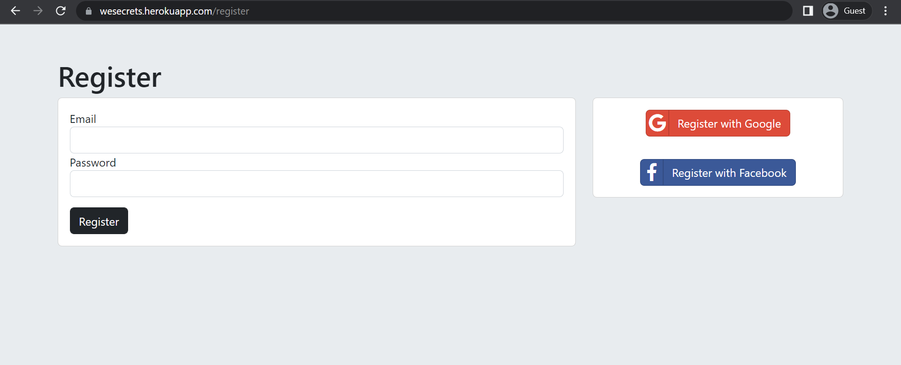
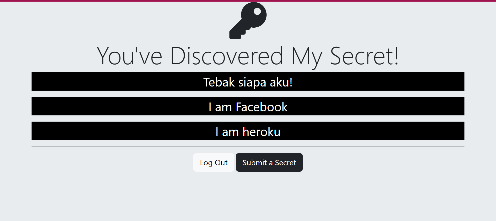
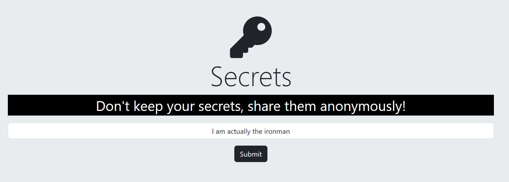

# MySecrets

MySecrets is a personal project where I built a web app, secrets. It is a web app that allows people to share their secrets anonymously. 
As I am learning building a web application, it is really important to maintain and secure my web app, like the users's data, and etc. 
So in this project is where I apply what I've studied about web security and implement several levels of security, for example hashing and salting user's passwords,
authenticating users through their usernames and passwords, and also I implement Google and Facebook OAuth just in case if the users don't want to create a new random account.
So when a user logs in, they can keep their informations safe and wipe out their worries of secrets revealed, as the only thing that posted on this web app is just their secrets.

## Features

As I mention above, users can register themselves through a conventional way by adding their email and password then click register button, or the can use their google
account or facebook account to register. Once they log in, they can see all the secrets people have posted without knowing whose secrets belong to. They can also submit their
own secrets and the content of it will also be visible to others.







## Usage

To use the project files, you can either just download the .ZIP file and extract it, or you can just clone this repo by going into your terminal and type
```bash
git clone https://github.com/NatureBase/MySecrets.git
```
(Note that you must specify where you want to clone the repository by changing the directory in your terminal).

I am using node verion `v16.18.0`, so you might want to change your node version first if you have a different one. Before open the files and use them, there are several dependencies that you must download first in your working directory, they are
- body-parser version `1.20.1`
- ejs version `3.1.8`
- express version `4.18.2`
- express-session version `1.17.3`
- mongoose version `6.6.5`
- mongoose-findorcreate version `3.0.0`
- passport version `0.6.0`
- passport-google-oauth20 version `2.0.0`
- passport-local version `1.0.0`
- passport-local-mongoose version `7.1.2`

### Technologies and Frameworks

Currently, I am hosting this project on Heroku (only until the end of November), you can access it via this link http://wesecrets.herokuapp.com , and for frameworks I am using is Bootstrap 5 
for simple UI design and also Font Awesome to get the free icons.

### License

ISC
